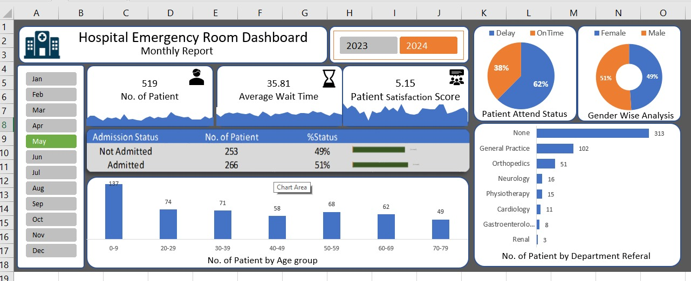

# 🏥 Hospital Emergency Room Dashboard

## 📌 Project Overview
This project is an interactive Hospital Emergency Room Dashboard developed in Microsoft Excel. It helps analyze patient visits, waiting time, admission status, department referrals, gender distribution, and patient satisfaction using interactive dashboards.

## Dashboard Preview

## 📊 Key Features
- Interactive Dashboard
- Pivot Tables
- Pivot Charts
- Slicers (Month & Year)
- Patient Admission Analysis
- Department-wise Analysis
- Gender-wise Analysis
- Daily Patient Trends
- Average Waiting Time Analysis
- Patient Satisfaction Analysis

## 🛠 Tools Used
- Microsoft Excel
- Pivot Tables
- Pivot Charts
- Slicers
- Conditional Formatting
- Data Visualization

## 📈 Dashboard KPIs
- Total Patients
- Average Wait Time
- Patient Satisfaction Score
- Admission Status
- Department Referral Analysis
- Gender Distribution

## 📂 Files Included
- Hospital dashboard.xlsx

## 🚀 How to Use
1. Download the Excel file.
2. Open it in Microsoft Excel.
3. Use the Month and Year slicers to interact with the dashboard.
4. Explore different sheets for detailed analysis.

## 👨‍💻 Author
**Shafik Ansari**

B.Tech CSE | Aspiring Data Analyst
